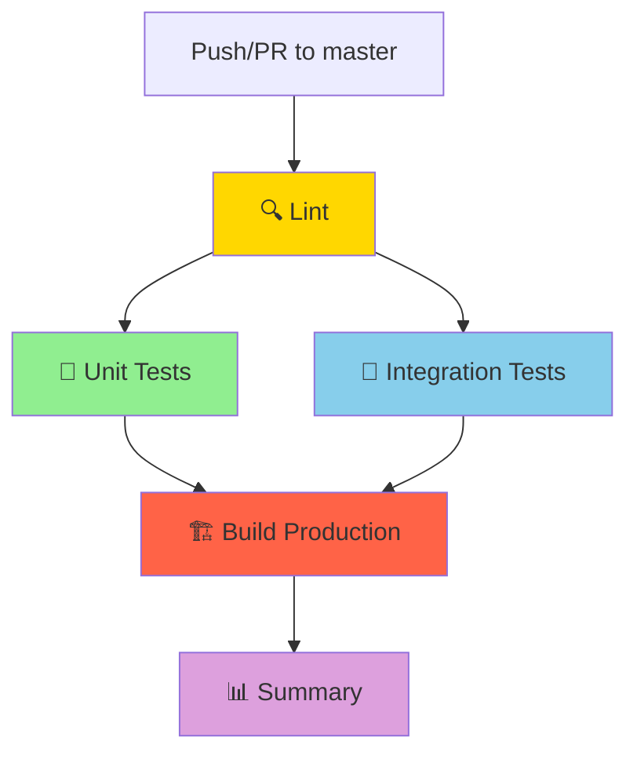

# 🚀 Build & Test Setup - Paragoniusz

## 📋 Przegląd

Pipeline automatycznie weryfikuje jakość kodu, uruchamia testy i buduje aplikację przy każdym push'u do brancha `master`.

## 🏗️ Architektura Pipeline



## 📦 Jobs

### 1. **🔍 Lint** (~2 min)
- Uruchamia ESLint na całym kodzie
- `continue-on-error: true` - nie blokuje pipeline przy ostrzeżeniach
- Zignorowane: `*.astro`, `src/db/database.types.ts` (auto-generated)

### 2. **🧪 Unit Tests** (~3-5 min)
- Uruchamia testy jednostkowe (Vitest)
- Wymaga: `lint` job
- Timeout: 15 minut

### 3. **🔗 Integration Tests** (~5-10 min)
- Uruchamia testy integracyjne z PostgreSQL
- Wymaga: `lint` job
- Service container: `supabase/postgres:15.1.0.147`
- Timeout: 20 minut

### 4. **🏗️ Build Production** (~2-4 min)
- Buduje aplikację w trybie produkcyjnym
- Wymaga: `unit-tests` + `integration-tests`
- Upload artifacts do GitHub (retention: 7 dni)
- Timeout: 15 minut

### 5. **📊 Summary** (~10 sek)
- Podsumowanie wyników wszystkich jobs
- Kończy pipeline z kodem błędu jeśli build failed

## 🔐 Wymagane GitHub Secrets

Dodaj następujące sekrety w **Settings → Secrets and variables → Actions**:

| Secret Name | Opis | Przykład |
|------------|------|----------|
| `SUPABASE_URL` | URL projektu Supabase | `https://xxxxx.supabase.co` |
| `SUPABASE_ANON_KEY` | Publiczny klucz API Supabase | `eyJhbGciOiJIUzI1NiIsInR5cCI6...` |

**⚠️ UWAGA:** NIE dodawaj `SUPABASE_SERVICE_KEY` - używamy tylko `ANON_KEY` dla bezpieczeństwa.

## 🚦 Triggery

Pipeline uruchamia się automatycznie przy:

1. **Push do master**
   ```bash
   git push origin master
   ```

2. **Pull Request do master**
   ```bash
   gh pr create --base master
   ```

3. **Manual Trigger** (workflow_dispatch)
   - GitHub → Actions → Build & Test → "Run workflow"

## 📊 Oczekiwane Czasy

| Job | Średni czas | Max timeout |
|-----|-------------|-------------|
| Lint | ~2 min | 10 min |
| Unit Tests | ~3-5 min | 15 min |
| Integration Tests | ~5-10 min | 20 min |
| Build | ~2-4 min | 15 min |
| **TOTAL** | **~12-21 min** | **60 min** |

## ✅ Kryteria Sukcesu

Pipeline **przechodzi** gdy:
- ✅ Build zakończył się sukcesem
- ⚠️ Lint może mieć ostrzeżenia (nie blokuje)
- ✅ Wszystkie testy przeszły pomyślnie

## 🐛 Debugging

### Problem: "Module not found" w testach

**Przyczyna:** Brak `npm ci` lub cache corruption

**Fix:**
```yaml
- name: 📦 Install dependencies
  run: npm ci --force
```

### Problem: Integration tests failing

**Przyczyna:** Brak zmiennych środowiskowych lub service container nie działa

**Check:**
1. Czy `SUPABASE_URL` i `SUPABASE_KEY` są ustawione w secrets?
2. Czy PostgreSQL service container jest healthy?

**Fix:**
```bash
# Lokalnie sprawdź integration tests
npm run test:integration
```

### Problem: Build timeout

**Przyczyna:** Zbyt długi build (>15 min)

**Fix:** Zwiększ timeout:
```yaml
timeout-minutes: 20
```

### Problem: Lint zawsze failuje

**Przyczyna:** Zbyt dużo błędów ESLint

**Temporary Fix:** Użyj `continue-on-error: true`
```yaml
- name: 🔍 Run ESLint
  run: npm run lint
  continue-on-error: true
```

## 📁 Artifacts

Build artifacts są automatycznie uploadowane i dostępne przez 7 dni:

**Lokalizacja:** GitHub Actions → Run details → Artifacts → `dist`

**Download:**
```bash
gh run download <run-id> -n dist
```

## 🔄 Aktualizacja Workflow

### Zmiana wersji Node.js

Edytuj `.nvmrc`:
```bash
echo "22.14.0" > .nvmrc
git add .nvmrc
git commit -m "chore: update Node.js to 22.14.0"
```

### Dodanie nowego job

```yaml
new-job:
  name: 🆕 New Job
  runs-on: ubuntu-latest
  needs: lint  # Zależność od innego job
  steps:
    - uses: actions/checkout@v4
    - uses: actions/setup-node@v4
      with:
        node-version-file: '.nvmrc'
    - run: npm ci
    - run: npm run custom-command
```

## 📚 Dodatkowe Zasoby

- [GitHub Actions Documentation](https://docs.github.com/en/actions)
- [Supabase CI/CD Guide](https://supabase.com/docs/guides/cli/github-action)
- [Astro Deployment](https://docs.astro.build/en/guides/deploy/)

## 🎯 Next Steps

1. ✅ Setup GitHub Secrets
2. ✅ Push to master → Verify pipeline
3. ⚠️ Fix any failing tests
4. 🚀 Deploy artifacts (optional - future)

---

**Utworzono:** 2025-12-14  
**Ostatnia aktualizacja:** 2025-12-14  
**Status:** ✅ Pipeline gotowy do użycia
