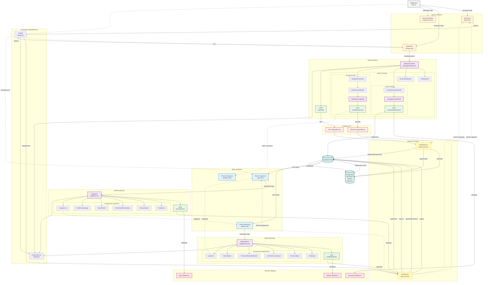

# Diagram Architektury UI - System Autentykacji

Ten diagram przedstawia kompleksową architekturę komponentów interfejsu użytkownika dla systemu autentykacji w aplikacji Paragoniusz.

## Legenda

### Kolory węzłów:

- **Niebieski** - Strony publiczne (dostępne bez logowania)
- **Pomarańczowy** - Strony chronione (wymagają autentykacji)
- **Fioletowy** - React Islands (komponenty interaktywne)
- **Zielony** - Custom Hooks (zarządzanie stanem)
- **Żółty** - Services (logika biznesowa)
- **Różowy** - Walidacja (schematy i funkcje)
- **Turkusowy** - Backend (Supabase + Database)
- **Czerwony** - API Endpoints
- **Szary** - Middleware

### Typy połączeń:

- `-->` Bezpośrednie wywołanie/renderowanie
- `-.->` Nawigacja/przekierowanie
- `==>` Przepływ danych

## Kluczowe przepływy użytkownika

### US-001: Rejestracja

1. User → `/register` → `RegisterForm`
2. `RegisterForm` → `useRegisterForm` → Walidacja (`register.validation.ts`)
3. Hook → `auth.service.ts` → Supabase Auth
4. Supabase → Database trigger → auto-create profile
5. Success → Redirect to `/` (Dashboard)

### US-002, US-003: Logowanie

1. User → `/login` → `LoginForm`
2. `LoginForm` → `useLoginForm` → Walidacja (`login.validation.ts`)
3. Hook → `auth.service.ts` → Supabase Auth
4. Supabase → JWT tokens → localStorage (if rememberMe)
5. Success → Redirect to `/`

### US-004: Wylogowanie

1. User → `NavBar` → button click
2. `NavBar` → `auth.service.ts.logoutUser()`
3. Supabase → Invalidate session → Clear localStorage
4. Success → Redirect to `/login`

### US-005: Zmiana hasła

1. User → `/settings` → `ChangePasswordForm`
2. Form → `useChangePassword` → Walidacja (`password.validation.ts`)
3. Hook → Supabase `auth.updateUser()`
4. Success → Success message

### US-006: Usunięcie konta

1. User → `/settings` → `DeleteAccountModal`
2. Modal → `useDeleteAccount` → `DELETE /api/profiles/me`
3. Endpoint → Supabase Admin API → Delete auth.users
4. Database CASCADE → Delete profile + expenses
5. Success → Logout → Redirect to `/goodbye`

## Aktualizacje wymagane

Zgodnie z specyfikacją autentykacji, następujące komponenty wymagają aktualizacji:

### 1. Middleware (`src/middleware/index.ts`)

- ✅ Obecnie: Dodaje Supabase client do context
- 🔄 Wymagane: Sprawdzanie autentykacji dla chronionych ścieżek

### 2. Dashboard (`src/pages/index.astro`)

- ✅ Obecnie: Sprawdzanie sesji wykomentowane
- 🔄 Wymagane: Odkomentowanie i aktywacja ochrony

### 3. NavBar (`src/components/NavBar.tsx`)

- ✅ Obecnie: Link do ustawień
- 🔄 Wymagane: Dodanie przycisku wylogowania

### 4. Settings (`src/pages/settings.astro`)

- ✅ Już implementowane: Sprawdzanie sesji aktywne

## Podział odpowiedzialności

### Server-Side (Astro Pages):

- Sprawdzanie sesji przed renderowaniem
- Przekierowania na podstawie stanu autentykacji
- Prefetchowanie danych użytkownika
- SEO i pierwsze renderowanie

### Client-Side (React Islands):

- Interaktywne formularze
- Walidacja w czasie rzeczywistym
- Zarządzanie stanem UI
- Obsługa błędów użytkownika

### Services:

- Komunikacja z Supabase Auth
- Mapowanie błędów
- Transformacja danych
- Business logic

### Hooks:

- Enkapsulacja logiki formularzy
- Zarządzanie stanem lokalnym
- Wywołania serwisów
- Obsługa cyklu życia komponentów
